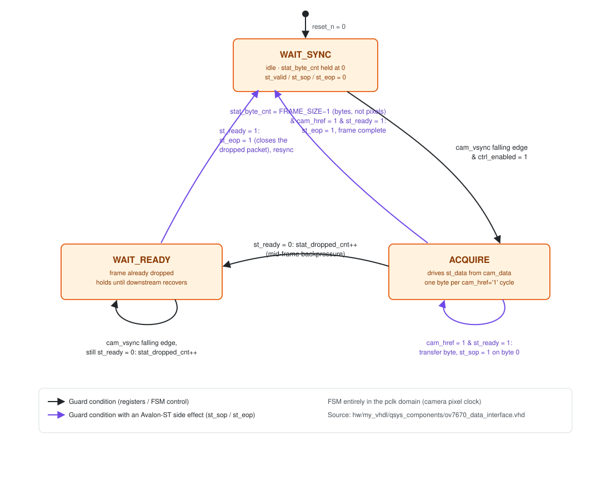
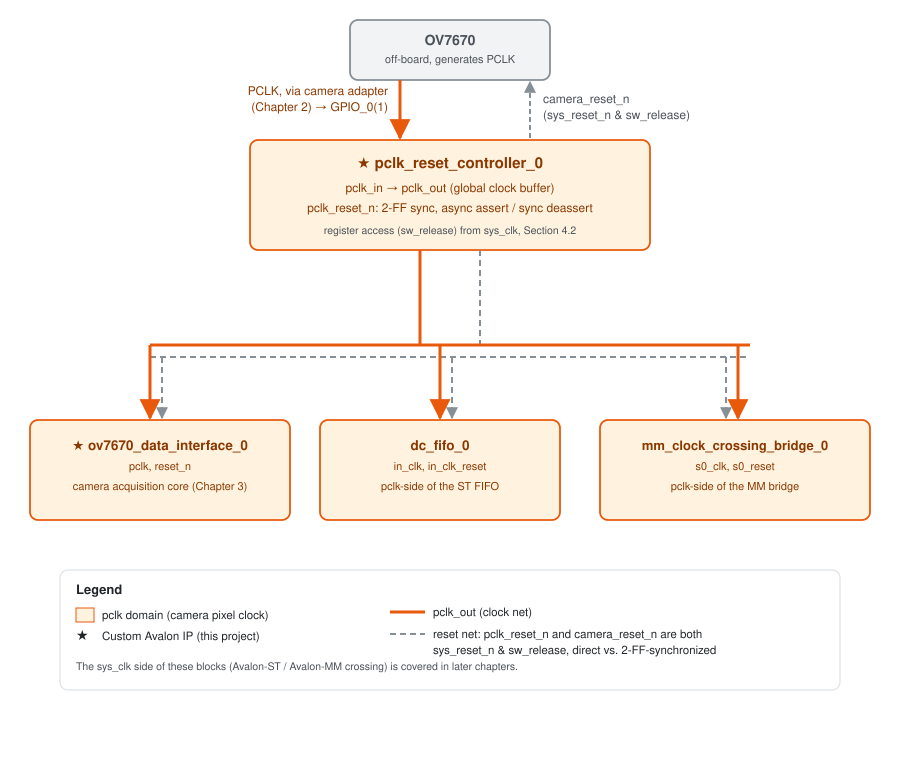
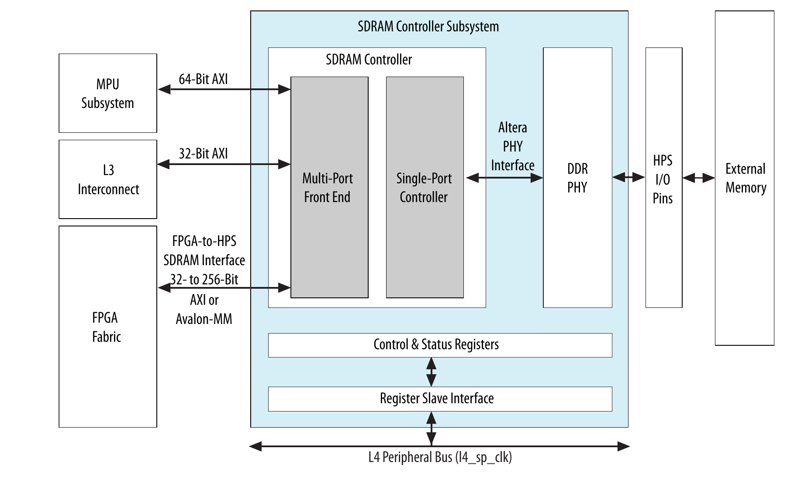
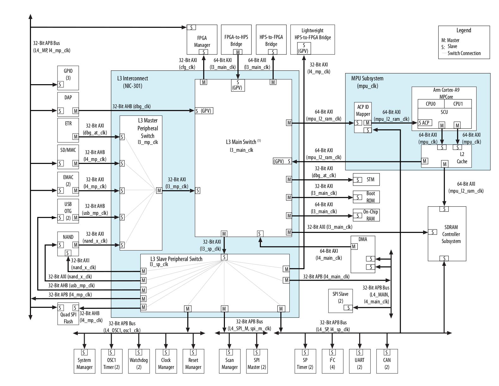

# 01. Hardware Overview

## 1. Overview

The purpose of the FPGA fabric in FPGAlix is to acquire the video stream
produced by an OV7670 camera module and transfer each frame into HPS
DDR3 while minimizing the involvement of the CPU in the acquisition
process. The processing cores are intended to configure a transfer once
and be notified upon its completion, without participating in the
handling of individual bytes. This requirement leads directly to the
adoption of the **mSGDMA** (modular Scatter-Gather DMA) core: an Avalon
Memory-Mapped DMA engine capable of reading from an Avalon-ST stream and
writing it to memory autonomously.

The remaining design question concerns how a byte-wide, framed data
stream, subject to backpressure and originating in the camera's own
clock domain, should reach the mSGDMA. **[Avalon-ST](#references)**
constitutes the natural choice for this purpose: it is the standard
Intel/Altera interconnect defined for unidirectional streaming
transfers, providing a ready/valid handshake for backpressure and
SOP/EOP markers for frame delimitation as part of the specification
itself. Moreover, it is the interface natively supported by every other
[IP core](#references) involved in the pipeline (`altera_avalon_dc_fifo`
for the clock-domain crossing, `altera_avalon_st_adapter` for width
conversion, `altera_avalon_sc_fifo` for buffering, and the ST-to-MM
engine internal to `altera_msgdma`).
Implementing the camera capture core (`ov7670_data_interface`) as an
Avalon-ST source, rather than as a custom bus, allows it to be
integrated directly into this chain without additional glue logic.

## 2. The OV7670 camera and its adapter board

### 2.1 OV7670 overview

The OV7670 is a CMOS VGA image sensor that does not generate its own
internal timing: correct operation requires an external **master clock**
(`XCLK`), from which all subsequent timing is derived. Once clocked and
configured, the sensor exposes the following signals:

- **`PCLK`**: pixel clock, generated by the sensor, synchronous with the data bus.
- **`HREF`**: asserted during each valid line.
- **`VSYNC`**: frame boundary marker.
- **`D[7:0]`**: 8-bit parallel data bus (format configurable as RAW Bayer, YUV422, or RGB565).
- **`SIOC`/`SIOD`**: SCCB, a two-wire control interface derived from I2C, used to access the sensor's configuration registers.
- **`RESET#`**, **`PWDN`**: reset and power-down control inputs.

Datasheet: [`OV7670_2006.pdf`](#references).

### 2.2 Rationale for a custom adapter board

Direct connection of an OV7670 breakout to the DE1-SoC's `GPIO_0` header
by means of unshielded jumper wires does not provide adequate signal
integrity at the sensor's clock frequency: the resulting ringing and
crosstalk are sufficient to corrupt sampling of `HREF`, `VSYNC`, and the
data bus. To address this, `hw/camera_adapter/` contains two
purpose-built PCBs, connected by a standard 40-pin GPIO ribbon cable:

- **Transmitter (camera side)**: mounted adjacent to the OV7670
  module. Each video signal (PCLK, HREF, VSYNC, D[7:0]) is driven
  through an `SN74ALVC16244A` line buffer and onto the ribbon cable through
  a 33 Ω series resistor.
- **Receiver (FPGA side)**: mounted at the DE1-SoC `GPIO_0` header.
  Each incoming video signal is terminated by a pair of 220 Ω resistors
  to `+3.3V` and to `DGND` (Section 2.4); the SDA/SCL lines are further
  provided with 4.7 kΩ pull-up resistors.

> **Note:** this is the same buffer device discussed in
> [`WARNING.md`](#references); the bus-hold defect described there
> concerns the buffer's **inputs** (camera side) and is unrelated to the
> termination network described below.

### 2.3 Camera master clock generation

The 24 MHz master clock (`Y1`, an `ECS-7050MV-240-BN-TR` HCMOS
oscillator) is located on the **transmitter** board, adjacent to the
sensor, and drives the sensor's `XCLK` directly through a 33 Ω series
resistor; this clock is not routed across the ribbon cable. The
alternative design, generating the clock on the FPGA/receiver side and
distributing it to the camera over the cable, would require an
additional buffer stage on that side as well. Locating a dedicated cheap
oscillator next to the sensor avoids the cost of this pricer second buffer and
removes the signal-integrity risk associated with distributing a 24 MHz
clock over the length of the ribbon cable.

### 2.4 Line termination

Two termination strategies are employed, one at each end of the cable:

- **Transmitter side:** 33 Ω series (source) resistors on every
  buffered output. Source termination matches the buffer's low output
  impedance to the line, damping reflections launched at the driving
  end.
- **Receiver side:** each video signal is terminated by a **Thevenin
  (split) termination**: a 220 Ω resistor to `+3.3V` in parallel with a
  220 Ω resistor to `DGND`. Their parallel combination presents
  220 Ω ∥ 220 Ω = 110 Ω to the line, matching the ribbon cable's
  estimated ~110 Ω characteristic impedance. This absorbs reflections
  arriving at the receiving end and, as a side effect, biases each line
  to mid-rail whenever it is not actively driven.

### 2.5 Video signal timing

The two datasheet figures below describe how the video pins behave, and
are the basis for the acquisition core described in the next chapter.

![OV7670 horizontal timing: PCLK, HREF and D[7:0] within one line](img/ov7670_fig5_horizontal_timing.png)

*Figure 2.1: OV7670 horizontal timing (source: OV7670/OV7171 datasheet, Figure 5).*

Within a line, `HREF`'s rising edge marks the start of a line and its
falling edge marks the end. `D[7:0]` changes around `PCLK`'s falling
edge and is valid to be sampled on the following rising edge, one byte
per `PCLK` cycle for as long as `HREF` stays high.

The number of bytes per pixel depends on the output format configured
over SCCB. RGB565, RGB555, RGB444, and YUV422 transmit each pixel as 2
bytes over 2 `PCLK` cycles. RAW Bayer and processed Bayer transmit each
pixel as a single byte, and to compensate the camera halves `PCLK`'s
frequency in that mode, so the pixel period (and with it, line and
frame timing, Figure 2.2 below) stays the same regardless of format.

Byte ordering and bit layout within each format are given in the
[datasheet](#references), not reproduced here.

![OV7670 VGA frame timing: VSYNC, HREF, HSYNC and D[7:0] across a full frame](img/ov7670_fig6_vga_frame_timing.png)

*Figure 2.2: OV7670 VGA frame timing (source: OV7670/OV7171 datasheet, Figure 6).*

Figure 2.2 gives the same picture at the scale of a whole frame. A frame
begins on `VSYNC`'s falling edge; after a blanking gap, the first line
begins at the first `HREF` rising edge (row 0). The last active row
(row 479) ends on its `HREF` falling edge, and after a further blanking
gap `VSYNC`'s next rising edge signals that the frame is complete. Over
a full frame this amounts to 480 active rows of 640 bytes each, which
is where the `FRAME_SIZE = 307200` parameter of `ov7670_data_interface_0`
comes from.

> `HSYNC` appears in Figure 2.2 for reference only: it is not a physical
> output pin on the OV7670. Only `PCLK`, `HREF`, and `VSYNC` are, and
> they are what the acquisition core actually uses to delimit frames
> and lines.

> **Hardware bug:** the camera must not be left in RESET or POWER-DOWN
> for extended periods. See [`WARNING.md`](#references) for details and
> mitigations.

## 3. The camera acquisition core (`ov7670_data_interface`)

`ov7670_data_interface` is a custom Platform Designer component that turns the
camera's `PCLK`/`HREF`/`VSYNC`/`D[7:0]` signals into the Avalon-ST
stream the rest of the pipeline expects (Chapter 1). Both its Avalon-ST
source and its Avalon-MM register interface run in the `pclk` domain,
the camera pixel clock. A single `ctrl` register lets software enable
acquisition (`ctrl_enabled`), drive the camera's power-down pin
(`ctrl_cam_pwdn`), and clear the dropped-frame counter
(`ctrl_clear_counters`); a second, read-only register
(`stat_dropped_cnt`) counts frames the core had to discard.

The core is a three-state machine, built directly on the `HREF`/`VSYNC`
behavior described in Section 2.5:

*Figure 3.1: State machine of `ov7670_data_interface`.*

- **`WAIT_SYNC`**: the reset and idle state. It waits for `cam_vsync`'s
  falling edge, the frame-start marker from Section 2.5, with
  acquisition enabled (`ctrl_enabled = 1`), and moves to `ACQUIRE`.
- **`ACQUIRE`**: for every `pclk` cycle with `cam_href = 1`, one byte of
  `cam_data` is transferred onto the Avalon-ST bus. `st_sop` is raised
  on the very first byte and `st_eop` on the `FRAME_SIZE`-th, `FRAME_SIZE`
  being a count of bytes, not pixels (Section 2.5), closing the frame
  and returning to `WAIT_SYNC`: the byte count, not a second `VSYNC`
  edge, is what ends the packet. If the downstream side
  deasserts `st_ready` at any point, the core does not stall; it counts
  the frame as dropped and moves to `WAIT_READY` instead.
- **`WAIT_READY`**: reached after a drop. The core waits for `st_ready`
  to return, then emits a bare `st_eop` so the downstream FIFO can
  discard the incomplete packet cleanly, and goes back to `WAIT_SYNC`.
  Each further `VSYNC` falling edge seen while still waiting counts as
  another dropped frame, so a downstream stall spanning several frames
  is reported accurately rather than silently swallowed.

## 4. Generating and resetting `pclk` (`pclk_reset_controller`)

Unlike `sys_clk` (`clk_0`, 50 MHz, free-running from the board
oscillator), `pclk` does not exist until the camera is powered up and
out of reset: it is generated by the OV7670 itself, derived internally
from the clock generator on the transmitter board (Section 2.3), and
only starts toggling once the sensor is running. `pclk_reset_controller`
is the custom Platform Designer
component that turns this externally-generated signal into a proper
clock domain for the rest of the design, and manages the two resets
that go with it.

*Figure 4.1: Distribution of `pclk` and its reset, from the camera to every pclk-domain block.*

### 4.1 `pclk` as a Platform Designer clock

`pclk_reset_controller` takes the physical `pclk` pin as `pclk_in` and
re-exports it as `pclk_out`, a genuine Platform Designer clock source:
`pclk_out <= pclk_in` in the VHDL, a pattern Quartus recognizes and
implements with a global clock buffer rather than ordinary fabric
routing.

### 4.2 The reset problem

The domain's reset is controlled by a single `sw_release` register bit,
reachable from `sys_clk` (offset 0x0 on the main Avalon-MM bus). A
synchronizer for it can't be built the ordinary way: logic sitting in
the `pclk` domain normally needs `pclk` edges to deassert its reset
cleanly, but `pclk` itself doesn't exist while the camera is held in
reset, so waiting on it to release its own gating reset would deadlock.

`pclk_reset_controller` resolves this by deriving two separate reset
outputs from the same condition, `sys_reset_n and sw_release`:

- **`camera_reset_n`**: purely combinatorial, entirely in the `sys_clk`
  domain, no dependency on `pclk` at all. This drives the camera's
  physical reset pin directly, so it is what gets the camera running
  and `pclk` toggling again.
- **`pclk_reset_n`**: a two-flip-flop synchronizer, clocked on
  `pclk_in`, that brings the same condition into the `pclk` domain for
  the acquisition logic. Assert is asynchronous, both flip-flops clear
  immediately when the condition drops, so the domain stays in reset
  even if `pclk` stops ticking mid-frame, while deassert is
  synchronous, two clean `pclk` edges after the camera comes back up,
  giving proper metastability protection for the moment `pclk` starts
  again. The first flip-flop carries a `SYNCHRONIZER_IDENTIFICATION
  FORCED` attribute, so Quartus TimeQuest treats it as a real
  synchronizer chain rather than an unconstrained path.

Because `camera_reset_n` has no dependency on `pclk`, releasing it is
always safe regardless of whether `pclk` is running.

### 4.3 Usage sequence

The dependency above dictates the order software has to follow:

1. Write `0` to `sw_release`: both `camera_reset_n` and `pclk_reset_n`
   are held low.
2. Write `1` to `sw_release`: `camera_reset_n` rises immediately,
   releasing the camera; `pclk_reset_n` follows two `pclk` edges later,
   once the camera starts driving `pclk` again.
3. Only once the camera is out of reset can it answer over SCCB, so I2C
   configuration has to come after this step, not before it.

## 5. The Avalon-ST pipeline: from `ov7670_data_interface` to `mSGDMA`

Chapter 1 established the rationale for streaming pixel data from the
camera to `mSGDMA` over Avalon-ST, such that the HPS is limited to
configuring a transfer and being notified upon its completion. This
chapter examines that stream in detail, from
`ov7670_data_interface_0.st_source` to the write into HPS DDR3; the
corresponding block diagram is provided in the system overview.

### 5.1 The pipeline

The stream traverses `ov7670_data_interface_0`, `dc_fifo_0`,
`st_adapter_0`, `sc_fifo_0`, and `msgdma_0`, in that order. Of these
components, only `dc_fifo_0` spans a clock-domain boundary: its
`in_clk` input is driven by `pclk_out` from `pclk_reset_controller_0`
(Chapter 4), while its `out_clk` output is driven by `sys_clk`. Every
component downstream of `dc_fifo_0`, namely `st_adapter_0`, `sc_fifo_0`,
and `msgdma_0`, operates entirely within the `sys_clk` domain.

### 5.2 Clock-domain crossing: `dc_fifo_0`

The domain crossing is performed at this point, immediately following
the camera acquisition core and prior to any width conversion, for two
reasons. First, crossing an 8-bit stream requires substantially less
synchronization logic than crossing a wider stream, since a
dual-clock FIFO requires synchronizers proportional to its data width.
Second, this arrangement confines the dependency on `pclk`, whose
frequency varies with the camera's output format (Section 2.5) and
which ceases entirely while the camera is held in reset (Chapter 4), to
the smallest possible portion of the design; every subsequent stage
operates against a single, stable clock.

`dc_fifo_0` is configured with a depth of 65536 entries at 8 bits,
providing an elastic buffer sufficient to absorb the rate difference
between `pclk` and `sys_clk`, as well as transient stalls on the
`sys_clk` side, without requiring backpressure to propagate to the
camera interface. Backpressure that does reach `ov7670_data_interface`'s
own FSM is instead handled by discarding the affected frame rather than
stalling (Chapter 3).

### 5.3 Width conversion: `st_adapter_0`

`st_adapter_0` converts the stream from 8-bit, single-symbol beats to
128-bit, 16-symbol beats. Performing this conversion after the
clock-domain crossing, rather than before it, keeps the synchronization
logic in `dc_fifo_0` narrow (Section 5.2) while providing `msgdma_0` and
its destination, HPS DDR3, with the wide beats their burst mechanisms
are designed around: a 128-bit Avalon-MM write makes substantially more
efficient use of SDRAM burst bandwidth than the equivalent data
transferred one byte at a time.

### 5.4 Buffering: `sc_fifo_0`

A single-clock, 128-bit buffer FIFO, 8192 entries deep, is placed
entirely within the `sys_clk` domain between the width converter and
`mSGDMA`. It accommodates timing variation between the arrival of data
from the pipeline and the availability of `mSGDMA` to issue a burst, for
example while `mSGDMA` is between bursts or the HPS memory bus is
occupied by other traffic.

### 5.5 Why a dedicated SDRAM port: bypassing the L3 interconnect

The HPS SDRAM controller is built around a multi-port front end (MPFE)
with ten independent command ports arbitrating for a single-port memory
controller: up to six of these ports are exposed directly to the FPGA
fabric as the FPGA-to-HPS SDRAM interface, two are wired to the L3
interconnect, and two to the MPU, the ARM cores (*Cyclone V Hard
Processor System Technical Reference Manual*, References). Each port
has its own buffering into the MPFE; a programmable arbiter then
selects, by absolute priority and, among ports of equal priority,
weighted round-robin, which port's pending transaction is forwarded to
the memory controller.

*Figure 5.1: SDRAM Controller Subsystem high-level block diagram (source: Cyclone V Hard Processor System Technical Reference Manual, Figure 12-1).*

`msgdma_0` reaches DDR3 through `hps_0_bridges.f2h_sdram1_data`, one of
these dedicated FPGA-to-HPS SDRAM command ports. This path does not
traverse the L3 interconnect, the ARM NIC-301 switch that carries MPU
and HPS-to-FPGA bridge traffic, at all: it enters the MPFE as an
independent command port and is arbitrated only against the other nine
MPFE ports. Reaching DDR3 through the HPS-to-FPGA bridge instead would
place the traffic on that same L3 switch, since the bridge is itself
mastered by the L3 main switch, competing for the interconnect bandwidth
the MPU depends on. The dedicated SDRAM port avoids that competition
entirely; the only resource `msgdma_0` shares with the CPU is the MPFE
arbiter and the DDR3 device itself.

*Figure 5.2: L3 Interconnect and L4 buses (source: Cyclone V Hard Processor System Technical Reference Manual, Figure 8-1). This diagram covers the L3-routed paths only; the FPGA-to-HPS SDRAM interface `msgdma_0` uses is not part of it and appears, aggregated, in Figure 5.1 instead. It is included here for the L2 Cache's two masters: one into the L3 Interconnect, one going straight to the SDRAM Controller Subsystem, the same separation `msgdma_0`'s dedicated port relies on.*

### 5.6 `mSGDMA`: from Avalon-ST to DDR3

`msgdma_0` reads from `sc_fifo_0.out` on its Avalon-ST sink and writes
each 128-bit beat through its Avalon-MM write master into HPS DDR3, via
`hps_0_bridges.f2h_sdram1_data`. With bursting enabled and a maximum
burst count of 512 beats, a single burst can transfer up to 8 KiB,
which is the justification for the wide data path established in
Sections 5.3 and 5.4.

Software drives `mSGDMA` through three interfaces reached over the LW
HPS bridge: `csr`, `descriptor_slave`, and `response`. Each transfer
begins with the HPS building a descriptor, specifying a destination
address in DDR3 and a transfer length, and writing its fields directly
into the `descriptor_slave` port; the data written is only staged, not
yet acted upon, until the descriptor's `Go` bit is written, which
commits the complete descriptor into the core's internal descriptor
FIFO. Queued descriptors are then processed autonomously, and on
completion of each one the HPS is notified both through an interrupt
and by a status write to the `response` port, giving the operating
model introduced in the first paragraph of this document: the HPS only
configures a transfer and is notified upon its completion.

Packet support is enabled on this instance specifically so that an
incoming `st_eop` can terminate a transfer instead of relying solely on
a fixed byte count: the descriptor's length field then stops being the
exact transfer size and becomes an upper bound instead, with the
transfer actually ending when `mSGDMA` observes `st_eop` on its sink.
This is precisely why
`ov7670_data_interface` frames the stream with `st_sop` and `st_eop` in
the first place (Chapter 3): a complete frame closes its own descriptor
via `st_eop` at `FRAME_SIZE` bytes, while the bare `st_eop` emitted for
a dropped frame (Chapter 3, `WAIT_READY`) closes the descriptor early,
before `FRAME_SIZE` bytes have been transferred. The `response` port
reports the actual number of bytes transferred between `st_sop` and
`st_eop` for each descriptor, which is how software distinguishes a
short, dropped frame from a complete one.

## References

- OmniVision, *OV7670/OV7171 CMOS VGA CameraChip Sensor* datasheet: [`docs/OV7670_CameraModule/OV7670_2006.pdf`](../OV7670_CameraModule/OV7670_2006.pdf).
- OmniVision, *OV7670 Implementation Guide (V1.0)*: [`docs/OV7670_CameraModule/OV7670 Implementation Guide (V1.0).pdf`](<../OV7670_CameraModule/OV7670 Implementation Guide (V1.0).pdf>).
- Intel/Altera, *Avalon Interface Specifications*: [`docs/Altera/AvaloBusSpecs.pdf`](../Altera/AvaloBusSpecs.pdf) (Avalon-MM and Avalon-ST).
- Intel/Altera, *Embedded Peripherals IP User Guide*: [`docs/Altera/EmbeddedPeripheralsIpGuide.pdf`](../Altera/EmbeddedPeripheralsIpGuide.pdf) (register maps and programming model for the standard Avalon IP cores used throughout this document).
- Intel/Altera, *Cyclone V Hard Processor System Technical Reference Manual*: [`docs/Altera/HPSManual.pdf`](../Altera/HPSManual.pdf) (SDRAM Controller Subsystem and MPFE Multi-Port Arbitration chapters; Figure 12-1, page 12-2, reproduced as Figure 5.1; Figure 8-1, page 8-2, reproduced as Figure 5.2).
- Camera adapter hardware bug note: [`hw/camera_adapter/WARNING.md`](../../hw/camera_adapter/WARNING.md).
- Camera adapter schematics: [`sch_transmitter.pdf`](../../hw/camera_adapter/sch_transmitter.pdf), [`sch_receiver.pdf`](../../hw/camera_adapter/sch_receiver.pdf).
- Camera adapter PCB layouts: [`brd_transmitter.pdf`](../../hw/camera_adapter/brd_transmitter.pdf), [`brd_receiver.pdf`](../../hw/camera_adapter/brd_receiver.pdf).
- Camera adapter bill of materials: [`BOM.pdf`](../../hw/camera_adapter/BOM.pdf) / [`BOM.xlsx`](../../hw/camera_adapter/BOM.xlsx).
- Photograph of the assembled camera adapter boards: [`assembled_system.jpg`](../../hw/camera_adapter/assembled_system.jpg).
