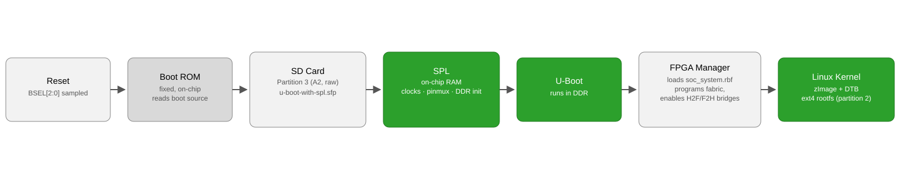
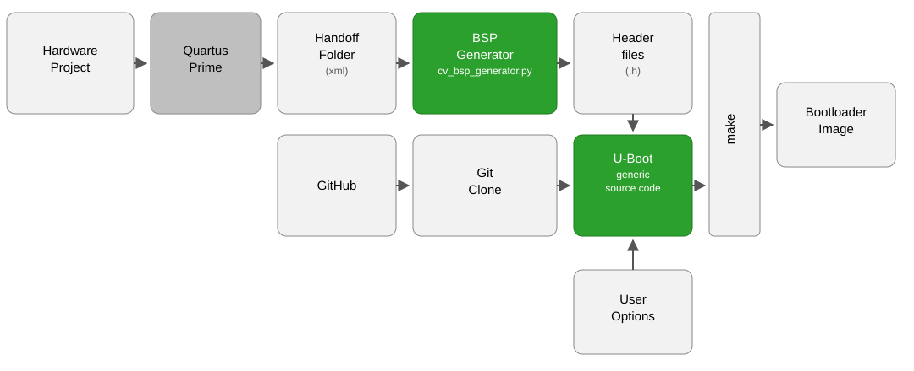

# 02. Board Bring-up

## 1. Required software

The following components must be installed and available on the `PATH`:

- Ubuntu 22.04 LTS x86_64
- Quartus Prime 22.1
- ARM GNU toolchain (`arm-gnu-toolchain-12.3.rel1-x86_64-arm-none-linux-gnueabihf`, `arm-none-linux-gnueabihf-`)

See [00. Prepare Your Dev Environment](00_PrepareDevEnvironment.md) for
the installation and configuration of the above, including the full
`apt` package list required by the kernel, U-Boot, Buildroot, and the
`sw/` programs discussed later in this chapter.

## 2. Introduction

On reset, the fixed-function **Boot ROM** samples the **BSEL[2:0]** pins
to select the boot source (SD/MMC, QSPI, NAND, or FPGA fallback). On the
DE1-SoC, `HPS_BOOTSEL[2:0]` is hardwired on the PCB to boot from SD/MMC.
The Boot ROM reads the combined **SPL** (Secondary Program Loader) +
U-Boot image from a dedicated **raw partition** (type `A2`) on the SD
card, loads it into on-chip RAM, verifies it, and hands control to SPL,
which brings up clocks, pin muxing and DDR. SPL then loads full
**U-Boot** into DDR.

From this point, U-Boot's boot script (`sw/boot.script`,
[Section 9](#9-boot-script)) loads the FPGA bitstream from the SD card
and programs the FPGA fabric through the HPS **FPGA Manager**, enables
the HPS-to-FPGA and FPGA-to-HPS bridges, and then loads the Linux kernel
(`zImage`) together with its Device Tree Blob, booting it with `bootz`.
The kernel mounts the second SD card partition (ext4) as its root
filesystem and starts init, which brings up the userspace built by
Buildroot ([Section 7](#7-building-the-root-filesystem-buildroot)).



*Figure 1: HPS boot chain, from reset to the Linux kernel.*

## 3. Bootloader generation flow

SoC EDS (Embedded Design Suite) was Altera's, later Intel's, companion toolset to Quartus for SoC FPGA embedded development. Since SoC EDS v19.1 Std / v19.3 Pro, the bootloader (U-Boot) build flow no longer relies on its GUI tool, `bsp-editor`, to configure and generate U-Boot. The current flow proceeds as follows:

1. The hardware project is compiled in Quartus Prime: this produces a **handoff folder**, a set of XML files describing how the HPS is configured (pin muxing, clocks, SDRAM timings, etc.).
2. `cv_bsp_generator.py` (part of the U-Boot source tree) is run on the handoff folder, generating the board-specific **header files** (`pinmux_config.h`, `pll_config.h`, `sdram_config.h`, `iocsr_config.h`).
3. These headers are copied into U-Boot's **generic source code**, together with any custom user options (device tree, `defconfig`, etc.).
4. `make` is invoked to build the bootloader image.



*Figure 2: Current bootloader generation flow (SoC EDS v19.1 Std / v19.3 Pro and later). Gray boxes are Quartus Prime; green boxes are part of U-Boot.*

> **Note:** Platform Designer's IP search path (`Tools > Options > IP
> Catalog`, "IP Search Path") is a Quartus-wide setting, not scoped to a
> single project. Every custom component used by this design
> (`pclk_reset_controller`, `ov7670_data_interface`, and the remainder
> found under `hw/my_vhdl/qsys_components/`,
> [01. Hardware Overview](01_Hardware.md)) resides there, and Platform
> Designer is able to resolve them only if that folder is listed. This
> setting should therefore be verified not only when configuring a new
> machine for the first time, but on every occasion where development
> switches between FPGAlix and another Platform Designer project on the
> same machine: each project maintains its own
> `hw/my_vhdl/qsys_components/`, and a search path left pointing at the
> other project's folder causes step 1 above to fail.

## 4. Getting the repository

The remainder of this chapter assumes that the FPGAlix repository has already been cloned locally, as follows, including submodules:

```bash
git clone --recurse-submodules https://github.com/tceccarini/FPGAlix.git
cd FPGAlix
```

The `--recurse-submodules` flag causes Git to additionally clone every submodule listed in `.gitmodules` at the same time; these are located under `repos/` (including `u-boot-socfpga`, required in the following section, and `linux-socfpga` and `buildroot`, required in Sections 6 and 7). In its absence, the corresponding directories would be created but left empty.

## 5. Building the bootloader

The following commands implement the flow shown in Figure 2 (Section 3), and are to be executed from the root of the repository.

### 5.1 Generate the BSP headers from the Quartus handoff

Compilation of the hardware project causes Quartus to export the HPS configuration as XML files under `hw/quartus/hps_isw_handoff/soc_system_hps_0/`. This configuration is then converted into the C header files required by U-Boot by means of the following command:

```bash
python3 repos/u-boot-socfpga/arch/arm/mach-socfpga/cv_bsp_generator/cv_bsp_generator.py \
    -i hw/quartus/hps_isw_handoff/soc_system_hps_0/ \
    -o repos/u-boot-socfpga/board/terasic/de1-soc/qts/
```

This step must be repeated whenever the HPS subsystem is modified in QSys (Platform Designer); otherwise U-Boot initializes the hardware according to stale configuration data.

### 5.2 Configure and build U-Boot

```bash
cd repos/u-boot-socfpga
export ARCH=arm
export CROSS_COMPILE=arm-none-linux-gnueabihf-
make socfpga_cyclone5_defconfig
make menuconfig
```

Within menuconfig, the board target is selected as follows:
**ARM architecture → Altera SOCFPGA board select → Terasic DE1-SoC (Cyclone V)**

Upon exiting, **Yes** must be confirmed when prompted to save the configuration; failure to do so leaves the incorrect board target selected, and the build silently targets the wrong hardware.

```bash
make -j$(nproc)
```

### 5.3 Result

The build produces `repos/u-boot-socfpga/u-boot-with-spl.sfp`, an image combining SPL and U-Boot in the Altera SoCFPGA format. This file is subsequently written, in raw form, to the boot partition of the SD card (Figure 1, [Section 10](#10-preparing-the-sd-card)); it is also accessible via the symlink `sdcard/u-boot-with-spl.sfp`.

## 6. Building the Linux kernel

The Linux source directory is entered and the required environment variables are set:

```bash
cd repos/linux-socfpga
export ARCH=arm
export CROSS_COMPILE=arm-none-linux-gnueabihf-
make socfpga_defconfig
```

### 6.1 Kernel configuration

The interactive configuration menu is opened with:

```bash
make menuconfig
```

#### 6.1.1 Base configuration

The base kernel configuration required by this project is as follows:

**Device Drivers → DMA Engine support**
- Altera / Intel mSGDMA Engine → `*` (built-in)

**Device Drivers → Input device support → Keyboards**
- GPIO Buttons → `*` (built-in)

**Device Drivers → LED Support**
- LED Class Support → `*` (built-in)
- LED Trigger support → LED Heartbeat Trigger → `*` (built-in)

#### 6.1.2 Configuration required by camera_driver_2

The following options are required specifically by `sw/camera_driver_2`
([its own README](../../sw/camera_driver_2/README.md) documents the
rationale for each; they are consolidated here so that the kernel need
only be built once):

**Device Drivers → Multimedia support**
- Multimedia support → `*` (built-in, `CONFIG_MEDIA_SUPPORT`). The option
  "Filter media drivers" should be left unchecked, as a consequence of
  which `MEDIA_CAMERA_SUPPORT` and `VIDEO_DEV` are enabled automatically.

**Device Drivers → Multimedia support → Media drivers → V4L platform devices**
- Aspeed AST2400/AST2500 Video Engine → `*` (built-in,
  `CONFIG_VIDEO_ASPEED`). `CONFIG_VIDEOBUF2_DMA_CONTIG` does not possess
  a corresponding menuconfig entry, being a hidden symbol; enabling this
  otherwise unrelated platform driver causes it to be selected as a side
  effect, since the driver itself depends on it. It is
  `videobuf2-dma-contig.ko` that is actually required by
  `camera_driver_2`; the Aspeed driver itself is never loaded on the
  target.

**Device Drivers → I2C support → I2C Hardware Bus support**
- Altera Soft IP I2C → `*` (built-in, `CONFIG_I2C_ALTERA`). In the
  absence of this option, the `altera_avalon_i2c` Qsys component
  (`compatible = "altr,softip-i2c-v1.0"`) remains invisible to Linux,
  preventing the camera from being configured over I2C whenever the bus
  is routed through the FPGA rather than the HPS.

**Memory Management options**
- Contiguous Memory Allocator → `*` (`CONFIG_CMA`)

**Library routines**
- DMA Contiguous Memory Allocator → `*` (`CONFIG_DMA_CMA`), Size in Mega
  Bytes → `16`. This setting is recommended rather than strictly
  mandatory: the requirement of three buffers of 640×480×1 byte amounts
  to under 1 MB, so the 16 MB default provides an ample margin.

Upon exiting menuconfig, **Yes** must be confirmed when prompted to save.

The compressed kernel image is built and the tree prepared for external kernel modules:

```bash
make -j$(nproc) zImage
make modules_prepare
make -j$(nproc) modules
```

### 6.2 Device Tree Source

Prior to building the Device Tree blobs, a board-specific DTS file must exist at:

```
repos/linux-socfpga/arch/arm/boot/dts/socfpga_cyclone5_fpgalix.dts
```

This file describes the hardware topology of the SoC and is maintained manually as `socfpga_cyclone5_fpgalix.dts`, which includes `socfpga_cyclone5.dtsi` (the standard SoCFPGA base provided by the kernel) and adds the board-specific nodes on top of it.

#### 6.2.1 The Device Tree Source is already provided

`socfpga_cyclone5_fpgalix.dts` is not part of the upstream kernel; it was authored for this project ([Section 6.3](#63-updating-the-device-tree-source)) and is already committed to this project's Linux kernel fork (`linux-socfpga`), which arrives as a submodule ([Section 4](#4-getting-the-repository)), matching the current hardware. If the Platform Designer hardware configuration has not changed, this file requires no further editing.

#### 6.2.2 Compiling the Device Tree Blob

Unlike the DTS source, the compiled Device Tree Blob (`.dtb`) is a build artifact: it is not tracked by the submodule, it does not exist after a fresh clone, and it must be compiled locally on every build, regardless of whether the DTS source itself was changed or not. This step is therefore always required, even when [Section 6.3](#63-updating-the-device-tree-source) is skipped entirely:

```bash
make dtbs
```

The compiled DTB is accessible via the symlink `sdcard/boot_partition/socfpga.dtb`, which points to `repos/linux-socfpga/arch/arm/boot/dts/socfpga_cyclone5_fpgalix.dtb`.

### 6.3 Updating the Device Tree Source

This section only applies when the HPS subsystem has been modified in Platform Designer; otherwise `socfpga_cyclone5_fpgalix.dts` ([Section 6.2](#62-device-tree-source)) already matches the current hardware, and this section can be skipped.

#### 6.3.1 Using sopc2dts as a reference

`sopc2dts` is Altera's own tool for generating a device tree from a `.sopcinfo` file, tracked in this project as the `repos/sopc2dts` submodule (a fork of `altera-opensource/sopc2dts`). It cannot, however, be employed as a direct DTS source for the kernel: its output is a standalone file that does not include `socfpga_cyclone5.dtsi`, and is therefore incompatible with the modern Linux SoCFPGA DTS infrastructure.

It remains useful, however, as a **reference**: its output reflects the current Platform Designer configuration, and is compared against `socfpga_cyclone5_fpgalix.dts` to identify which addresses, interrupt numbers and compatible strings changed, updating the latter accordingly.

The `sopc2dts` utility itself is not prebuilt: it is a plain Java tool (`javac`/`jar`, no Quartus or Buildroot toolchain involved) and must be compiled from source once, the first time it is used:

```bash
cd repos/sopc2dts
make all
```

The reference output is then generated with:

```bash
java -jar sopc2dts.jar --input ../../hw/quartus/soc_system.sopcinfo --output /tmp/socfpga_ref.dts
```

#### 6.3.2 Authoring the Device Tree Source from the reference

In this project, `socfpga_cyclone5_fpgalix.dts` was authored from the `sopc2dts` reference output using Claude Code, an AI coding assistant, rather than written by hand. The reference DTS generated by `sopc2dts` (`/tmp/socfpga_ref.dts` above) was given as input, not the raw `soc_system.sopcinfo`: providing the latter directly led to significantly less accurate results, since it left the extraction of addresses, interrupt numbers and compatible strings to the assistant itself, rather than to `sopc2dts`. Manual authoring remains entirely possible: `socfpga_cyclone5_fpgalix.dts` is a plain text file, and the task consists solely of transcribing addresses, interrupt numbers and compatible strings from the reference output, for those who prefer to do so directly.

## 7. Building the root filesystem (Buildroot)

The Buildroot directory is entered and the required environment variables are set:

```bash
cd repos/buildroot
export ARCH=arm
export CROSS_COMPILE=arm-none-linux-gnueabihf-
```

### 7.1 Buildroot configuration

The configuration menu is opened with:

```bash
make menuconfig
```

#### 7.1.1 Base configuration

The base configuration required by this project is as follows:

**Target options**
- Target Architecture → `ARM (little endian)`
- Target Architecture Variant → `cortex-A9`
- Enable NEON SIMD extension support → `Y`
- Enable VFP extension support → `Y`
- Floating point strategy → `NEON`

> This last setting is not selected automatically: enabling "Enable VFP
> extension support" makes several floating-point strategies available
> (`VFPv3`, `NEON`, among others), and since the default chosen by
> Buildroot is not `NEON`, it must be selected explicitly. The
> NEON-accelerated OpenCV and libjpeg-turbo code of `sw/vision_core`
> depends on this setting.

**Toolchain**
- C library → `glibc`
- Enable C++ support → `Y`
- Build cross gdb for the host → `Y`
- Target ABI → `EABIhf`

**System configuration**
- `/dev` management → `Dynamic using devtmpfs + eudev`
- Enable root login with password → `Y`
- Root password → *(set a password)*

**Target packages → Debugging, profiling and benchmark**
- `gdb` → `Y`, then enable `gdbserver`
- `strace` → `Y`

**Target packages → Hardware handling**
- Show packages that are also provided by busybox → `Y`
- `i2c-tools` → `Y`

**Target packages → Networking applications**
- `chrony` → `Y` (NTP client)
- `dhcpcd` → `Y` (DHCP client)
- `ethtool` → `Y` (Ethernet diagnostics)
- `ifupdown-scripts` → `Y` (ifup/ifdown support)
- `iperf3` → `Y` (bandwidth testing)
- `iproute2` → `Y` (`ip addr`, `ip route`)
- `openssh` → `Y` (SSH server and client)
- `sshfs` → `Y` (mount remote filesystems over SSH)
- `tcpdump` → `Y` (network packet capture)

**Target packages → System tools**
- `htop` → `Y`
- `kmod` → `Y`
- `util-linux` → `Y`
- `xz` → `Y`
- `zip` → `Y`

**Target packages → Text editors and viewers**
- `nano` → `Y`

`ifconfig` needs no package of its own: it is provided by BusyBox
(`CONFIG_IFCONFIG`), already enabled by default in this project's
BusyBox configuration. `ip addr`/`ip route`, from `iproute2` above, are
also available.

#### 7.1.2 Configuration required by camera_driver_2 and vision_core

The following packages, in addition to those already listed, are
required specifically by `sw/camera_driver_2` and `sw/vision_core`, per
their respective READMEs
([camera_driver_2](../../sw/camera_driver_2/README.md),
[vision_core](../../sw/vision_core/README.md)), which document the
rationale for each. They are consolidated here so that a single build
suffices:

**Target packages → Libraries → Hardware handling**
- `libv4l` → `Y`, with `v4l-utils tools` enabled (provides `v4l2-ctl`)

**Target packages → Libraries → Graphics**
- `opencv4` → `Y`, with the following enabled: `imgcodecs`, `imgproc`,
  `videoio`, `jpeg support`, `v4l support`, `tbb support`
- `libjpeg-turbo` → `Y`

**Target packages → Audio and video applications**
- `gstreamer 1.x` → `Y`, with the following sub-plugins enabled:
  - `gst1-plugins-base` → `app`
  - `gst1-plugins-base` → `videoconvertscale`
  - `gst1-plugins-good` → `rtpmanager` (not `rtp`)
  - `gst1-plugins-bad` → `openh264` (H264 output only)
  - `gst1-rtsp-server` → `Y`

Upon exiting menuconfig, **Yes** must be confirmed when prompted to save.

### 7.2 Build

```bash
make
```

The `-j$(nproc)` flag should not be used: Buildroot manages parallelism internally. The default settings already instructs Buildroot to employ all available CPU cores throughout the entire build (toolchain, packages, and root filesystem). The root filesystem image is generated at `repos/buildroot/output/images/rootfs.tar`, accessible via the symlink `sdcard/rootfs.tar`, alongside the remaining SD card artifacts.

This same build also produces the toolchain used by the `make arm`
target of `sw/vision_core`, at `repos/buildroot/output/host/bin/`; this
Buildroot build must therefore complete before `vision_core` can be
cross-compiled.

## 8. Generating the FPGA bitstream (RBF)

The FPGA fabric on the DE1-SoC may be configured through several paths: over JTAG from Quartus, over JTAG via a JTAG adapter tool, or by the HPS itself at boot, through the FPGA Manager. FPGAlix employs the last of these: U-Boot loads the bitstream from the SD card and programs the fabric through the FPGA Manager, prior to booting Linux ([Section 2](#2-introduction)).

### 8.1 MSEL configuration (SW10)

Which of these paths is used is a hardware setting, selected by the MSEL[4:0] pins. For U-Boot to be the one that programs the FPGA fabric, as described above, MSEL[4:0] must select the FPGA Manager path. On the DE1-SoC, this is set with the **SW10** DIP switch, located on the underside of the board.

> **Note:** SW10 employs **negative logic**: the ON position corresponds to logic 0, and the OFF position to logic 1.

Set the six SW10 switches, on the underside of the board, to the positions given in the table below, which select the FPGA Manager path (MSEL[4:0] = `00000`):

| Switch | Signal | Position | Logic |
|--------|--------|----------|-------|
| SW10.1 | MSEL0  | ON       | 0     |
| SW10.2 | MSEL1  | ON       | 0     |
| SW10.3 | MSEL2  | ON       | 0     |
| SW10.4 | MSEL3  | ON       | 0     |
| SW10.5 | MSEL4  | ON       | 0     |
| SW10.6 | —      | OFF      | 1     |

### 8.2 Converting the SOF to RBF

Quartus compiles the hardware project into a `.sof` (SRAM Object File), the complete FPGA configuration, expressed in a format understood only by Quartus/JTAG tools. The FPGA Manager instead requires an `.rbf` (Raw Binary File), a stripped-down version of the same configuration, obtained by conversion from the root of the repository:

```bash
quartus_cpf -c hw/quartus/output_files/FPGAlix.sof sdcard/boot_partition/soc_system.rbf
```

The resulting output is placed directly under `sdcard/boot_partition/`, alongside the remaining files destined for the SD card's boot partition.

## 9. Boot script

`sw/boot.script` was authored for this project: a human-readable U-Boot script that defines the boot sequence. It persists the automatically generated MAC address on first boot, sets the kernel command line (serial console on `ttyS0` at 115200 baud, root filesystem on the SD card's second partition, mounted read-write), loads and programs the FPGA bitstream generated in [Section 8](#8-generating-the-fpga-bitstream-rbf), enables the HPS-to-FPGA and FPGA-to-HPS bridges, and finally loads the Linux kernel (`zImage`) and the Device Tree Blob (`socfpga.dtb`), booting the system.

This script must be compiled into the binary image that U-Boot expects to find on the boot partition:

```bash
cd sw/
mkimage -A arm -O linux -T script -C none -a 0 -e 0 -n "Boot" -d boot.script ../sdcard/boot_partition/u-boot.scr
```

This step must be repeated whenever `sw/boot.script` is modified.

## 10. Preparing the SD card

> **WARNING:** This section involves low-level disk operations. An incorrect device name or a mistyped command can silently overwrite a system disk, a data partition, or any other block device on the machine in use. Every device path (`/dev/sdX`, `/dev/loopN`) should be double-checked before pressing Enter; when in doubt, the operation should be stopped and verified.

The SD card requires three partitions: a FAT32 boot partition (kernel, DTB, bitstream, boot script), an ext4 root filesystem, and the raw A2 partition for U-Boot. All files destined for the card are collected under `sdcard/`. A disk image file is constructed first and subsequently written to the physical SD card; the same procedure may be applied **directly to the SD card** by substituting the SD card device (e.g. `/dev/sdX`) for `sdcard/images/sdcard.img`, thereby omitting the image creation step and the final `dd`/Etcher write.

The final image may be written to the SD card using:
- **Linux:** `dd` (see the last step below)
- **Windows/Mac:** [balenaEtcher](https://etcher.balena.io/), free and open-source software; the image and target drive are selected accordingly.

### 10.1 Create the image file

From the root of the repository, the `sdcard/` directory is entered:

```bash
cd sdcard/
mkdir -p images
```

An empty image is created, sized to accommodate any "8 GB" SD card. SD card manufacturers employ decimal units (1 GB = 1,000,000,000 bytes), such that an "8 GB" card provides approximately 7629 MiB of actual space; 7400 MiB is used here to leave a safe margin:

```bash
dd if=/dev/zero of=images/sdcard.img bs=1M count=7400
```

### 10.2 Partition the image

```bash
fdisk images/sdcard.img
```

Within `fdisk`, the following commands are entered in order:

```
o              # new MBR partition table

n              # partition 1, FAT32 boot (500 MiB)
p
1
(enter)
+500M
t              # set type to W95 FAT32 LBA
c

p              # print disk info, note "Sectors" and "Sector size"
```

Prior to creating partition 3, its first sector must be calculated:

```
first_sector_p3 = total_sectors - ceil(10 * 1024 * 1024 / sector_size)
```

Example, assuming 512-byte sectors and a 7400 MiB image (total sectors = 15,155,200):

```
first_sector_p3 = 15,155,200 - ceil(10 * 1024 * 1024 / 512)
               = 15,155,200 - 20,480
               = 15,134,720
```

Partition 3 is then created at that position:

```
n              # partition 3, raw A2, U-Boot SPL (10 MiB)
p
3
15134720       # enter the calculated first sector
(enter)        # accept default last sector (end of disk), fdisk should confirm ~10 MiB
t              # set type to A2 (Altera SoCFPGA bootloader)
3
a2

n              # partition 2, ext4 rootfs (fills remaining space)
p
2
(enter)        # fdisk auto-selects first sector after p1
(enter)        # fdisk auto-selects last sector before p3

p              # verify the partition table before writing
w              # write and exit
```

For this example (512-byte sectors, 7400 MiB image), the expected output of `p` is as follows:

```
Disk images/sdcard.img: 7,23 GiB, 7759462400 bytes, 15155200 sectors
Units: sectors of 1 * 512 = 512 bytes
Sector size (logical/physical): 512 bytes / 512 bytes
I/O size (minimum/optimal): 512 bytes / 512 bytes
Disklabel type: dos
Disk identifier: 0x2df93d98

Device             Boot    Start      End  Sectors  Size Id Type
images/sdcard.img1          2048  1026047  1024000  500M  c W95 FAT32 (LBA)
images/sdcard.img2       1026048 15134719 14108672  6,7G 83 Linux
images/sdcard.img3      15134720 15155199    20480   10M a2 unknown
```

### 10.3 Attach the image to a loop device

```bash
sudo losetup -fP images/sdcard.img
```

The assigned loop device is identified with:

```bash
losetup -l
```

The entry corresponding to `sdcard.img` is located and its device name noted (e.g. `/dev/loop2`). In each of the commands below, `N` is to be replaced with the actual number.

### 10.4 Format the partitions

```bash
sudo mkfs.vfat -n BOOT /dev/loopNp1
sudo mkfs.ext4 -L rootfs /dev/loopNp2
# loopNp3 is left unformatted, it will receive the raw U-Boot image with dd in the next step
```

### 10.5 Mount and copy the files

All commands below, like the rest of this section, are run from `sdcard/` ([Section 10.1](#101-create-the-image-file)); `boot_partition/`, `rootfs_overlay/`, `rootfs.tar` and `u-boot-with-spl.sfp` are paths relative to it.

```bash
cd sdcard/
sudo mkdir -p /tmp/sdcard/boot /tmp/sdcard/rootfs
sudo mount /dev/loopNp1 /tmp/sdcard/boot
sudo mount /dev/loopNp2 /tmp/sdcard/rootfs
```

The boot partition files are copied (kernel, DTB, bitstream, boot script, from Sections 6, 8 and 9):

```bash
sudo cp -L boot_partition/* /tmp/sdcard/boot/
```

The root filesystem built in [Section 7.2](#72-build) is extracted:

```bash
sudo tar xvf rootfs.tar -C /tmp/sdcard/rootfs/
```

The NTP configuration is copied onto the rootfs:

```bash
sudo cp -L rootfs_overlay/etc/chrony.conf /tmp/sdcard/rootfs/etc/
```

U-Boot (SPL and U-Boot proper, from [Section 5](#5-building-the-bootloader)) is written raw into the A2 partition:

```bash
sudo dd if=u-boot-with-spl.sfp of=/dev/loopNp3 bs=64k seek=0
sync
```

### 10.6 Unmount, detach and clean up

```bash
sudo umount /tmp/sdcard/boot /tmp/sdcard/rootfs
sudo losetup -d /dev/loopN
sudo rm -rf /tmp/sdcard
```

### 10.7 Write the image to the SD card

```bash
sudo dd if=images/sdcard.img of=/dev/sdX bs=4M status=progress
sync
```

`/dev/sdX` must be replaced with the actual SD card device. **The target device must be verified with particular care** prior to execution, as this command overwrites it in its entirety.

## 11. Booting the board

The MSEL configuration has already been established in [Section 8.1](#81-msel-configuration-sw10).

1. The SD card is inserted into the slot on the underside of the board.
2. A mini USB cable is connected between the **UART-to-USB** connector on the board (labelled on the PCB) and the PC.
3. An Ethernet cable is connected between the board and the local network.

The board exposes a serial console at **115200 baud, 8N1, no flow control**:

- **Linux:** `picocom`. The device is identified with `dmesg | grep tty` (typically `/dev/ttyUSB0`), and connection established with `picocom -b 115200 /dev/ttyUSB0`.
- **Windows:** [TeraTerm](https://teratermproject.github.io/). The COM port that appears in Device Manager under *Ports (COM & LPT)* upon connecting the cable is selected.

4. Upon powering on the board, the boot log should appear in the terminal immediately, concluding with a login prompt.

### 11.1 Logging in and network access

The board is logged into as `root` over the serial console, with the password set in [Section 7.1.1](#711-base-configuration).

SSH access as `root` does not work, even though the serial console login does: OpenSSH's default `PermitRootLogin` setting only allows root to log in with a key, not a password, and this project's root account only has a password. A new user must therefore be created, from the serial console:

```bash
adduser <username>
```

The board's IP address, obtained automatically over Ethernet by `dhcpcd` ([Section 7.1.1](#711-base-configuration)), can then be read with either:

```bash
ifconfig
# or
ip addr
```

From the PC, SSH access as the new user can then be verified:

```bash
ssh <username>@<board-ip>
```

## 12. References

- [Bootloader generation flow for SoC EDS v19.1 std / v19.3 pro or later](<../Misc/Macnica - Bootloader generation flow.pdf>), Macnica. History of the bootloader build flow (Figure 2, Section 3) and the `cv_bsp_generator.py` step.
- [Cyclone V Hard Processor System Technical Reference Manual](../Altera/HPSManual.pdf), Altera. Boot ROM, BSEL[2:0] and boot source selection (Section 2).
- [DE1-SoC schematic](../Terasic_DE1-SoC/Schematic.pdf), Terasic. `HPS_BOOTSEL[2:0]` hardwiring on this board (Section 2).
- [`repos/u-boot-socfpga`](../../repos/u-boot-socfpga), local submodule. Source used to build the bootloader (Section 5) and the boot script (Section 9).
- [`repos/linux-socfpga`](../../repos/linux-socfpga), local submodule. Kernel source (Section 6).
- [`repos/buildroot`](../../repos/buildroot), local submodule. Root filesystem source (Section 7); `docs/manual/prerequisite.adoc` and the individual `package/*/Config.in` files constituted the source consulted for [Section 7.1](#71-buildroot-configuration), rather than any project README.
