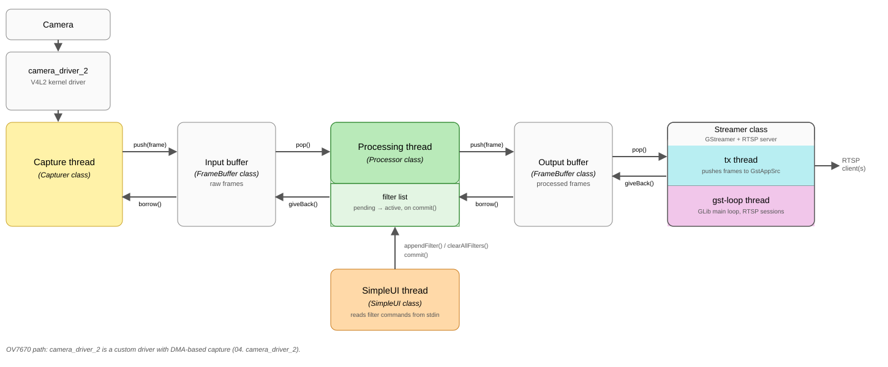

# 05. vision_core

## 1. Introduction

`sw/vision_core` is a real-time streaming pipeline, built on OpenCV and GStreamer: it captures frames from a V4L2 device, runs them through a filter pipeline, and streams the result out over RTSP (`rtsp://<board-ip>:8554/stream`). Its purpose within this project was to exercise the hardware and software configuration built up through the previous chapters, and observe how the CPU behaved under load.

Two capture sources are supported, through the same pipeline: the OV7670, via `camera_driver_2` ([04. camera_driver_2](04_CameraDriver2.md)), and any generic V4L2 webcam. The filter pipeline is hot-swappable at runtime, edited through a text interface, `SimpleUI` ([its own README](../../sw/vision_core/README.md)), built with the assistance of Claude Code: filters such as auto white balance, gamma correction, Bayer demosaicing and Sobel edge detection can be added, removed or reordered while streaming, without dropping frames. The output can be encoded as MJPEG, left uncompressed, or encoded as H264; MJPEG is what this project's own notes recommend for full-color output, since the HPS has no hardware video encoder and software H264 is comparatively expensive on a Cortex-A9.

It runs as several concurrent threads, free to run across both of the HPS's two Cortex-A9 cores rather than confined to one; [Section 2](#2-software-architecture) describes how they are organized.

## 2. Software architecture

Unlike the earlier chapters, little of this component's behavior is visible at the hardware level: V4L2, OpenCV and GStreamer hide the camera, the CPU cores and the memory behind their own abstractions, and `vision_core` is structured as a chain of concurrent stages connected by buffer pools rather than as anything resembling the hardware block diagram of [01. Hardware Overview](01_Hardware.md).

Three stages make up the pipeline described in [Section 1](#1-introduction), each running on its own thread: a capture thread (`Capturer`) pulls a raw frame from the video device, whether the OV7670 through `camera_driver_2` or a generic webcam, and copies it into a frame borrowed from the input buffer; a processing thread (`Processor`) takes that frame, runs it through the current filter pipeline, and writes the result into the output buffer; and a transmission thread takes the processed frame from the output buffer and hands it to GStreamer. A further thread, belonging to the same `Streamer` class, runs GStreamer's own event loop and handles RTSP session and client-connection management on its own, independently of the frame data path. `SimpleUI` runs on a fifth thread of its own, reading filter commands from standard input and editing the processing thread's pending filter list; the edits are swapped into the active list by the processing thread itself, at the start of its next iteration, so the pipeline can be changed while streaming without pausing or dropping a frame for it.

The input buffer and output buffer (`FrameBuffer`) sit between capture and processing, and between processing and transmission, respectively. Each is a fixed number of pre-allocated frames, so that no stage needs to allocate memory while running: a stage borrows a free frame, fills it in place, and hands it off to the next stage, which picks it up and eventually returns it to the buffer it came from once finished with it, whether directly or, for the output buffer, only once GStreamer itself is done with it. If a stage falls behind, the buffer it borrows from can run dry, or the buffer it hands frames into can fill up; either way, the frame in flight is dropped rather than the pipeline stalling to wait for space.



*Figure 2.1: `vision_core`'s software pipeline: threads and the frame pools connecting them. Each color marks a separate thread; white/plain boxes are not threads, but the buffers and endpoints connecting them.*

## 3. Frame loss under load

### 3.1 The FIFO mitigations

During testing, frame loss appeared already under moderate CPU load, not only under extreme load. This loss originates entirely on the input side: when the FPGA fabric cannot drain a frame fast enough, `ov7670_data_interface` is backpressured on `st_ready`, drops the frame in progress, and closes it with a bare EOP once the backpressure lifts ([01. Hardware Overview, Section 4](01_Hardware.md#4-the-camera-acquisition-core-ov7670_data_interface)). It is the same premature EOP `camera_driver_2` was later made to detect and discard as a short frame ([04. camera_driver_2, Section 4](04_CameraDriver2.md#4-detecting-short-frames)). Addressing it took several rounds of tuning the FPGA data path, tracked in `hw/quartus/soc_system.qsys`:

- `dc_fifo_0`'s depth was increased repeatedly, from its original 32 entries up to 256, then 4096, and finally 65536, effectively as large as the Quartus fitter would allow.
- The mSGDMA engine's own `DATA_FIFO_DEPTH` and `DESCRIPTOR_FIFO_DEPTH` were increased (to 4096 and 256 respectively), its maximum burst size raised, and both it and the HPS SDRAM port it drives were widened to 128 bits, for faster draining.
- A new buffer FIFO, `sc_fifo_0`, was added directly ahead of mSGDMA, sized at 8192 entries, 128 bits wide. It did not exist in the original design. It is shown in the block diagram and described in [01. Hardware Overview, Section 5.4](01_Hardware.md#54-buffering-sc_fifo_0).

These changes measurably helped, but were not, on their own, what fixed frame loss under load.

### 3.2 The actual fix: returning buffers to the driver immediately

The definitive mitigation was a change in `vision_core` itself, not in the FPGA fabric: instead of holding on to a V4L2 buffer for the entire filter pipeline, `Capturer` copies the frame out of it immediately after dequeuing it, and returns the buffer to the driver right away:

```cpp
wrapBuffer(m_inputBuffer[buf.index].start, ...).copyTo(frame->mat());
...
// Return buffer to the driver only after copyTo() has finished reading it
ioctl(m_v4l2DeviceDescriptor, VIDIOC_QBUF, &buf);
```

This is the change that, empirically, fixed the frame loss the FIFO enlargements in [Section 3.1](#31-the-fifo-mitigations) had only partially addressed.

### 3.3 What this led to in FPGAsteel

This project's successor, FPGAsteel, targets the same OV7670 capture pipeline but bare-metal instead of embedded Linux, and took a different approach entirely: enabling the mSGDMA's hardware descriptor prefetcher, with its own dedicated on-chip descriptor memory, so the DMA engine re-arms itself between frames without CPU intervention. This project leaves the prefetcher disabled and manages descriptors from software instead, because enabling it here would have meant writing a dedicated kernel driver for it from scratch; bare-metal software accesses the hardware directly, and integration is simpler without a kernel to integrate with. With the prefetcher handling re-arming directly from on-chip SRAM instead, FPGAsteel needed neither FIFOs the size of this project's, nor an equivalent to `sc_fifo_0` at all.

## 4. Building

```bash
cd sw/vision_core
make arm
```

This produces `bin/vision_core`, cross-compiled with the toolchain Buildroot builds as part of its own run ([02. Board Bring-up, Section 7.2](02_BoardBringUp.md#72-build)), which must therefore already exist. A separate, native `make intel` target also exists, for exercising the pipeline on the host itself without the board ([00. Prepare Your Dev Environment, Section 2.1](00_PrepareDevEnvironment.md#21-apt-packages)).

## 5. Usage

Beyond the DE1-SoC board itself, this requires an OV7670 camera module and the custom camera adapter connecting it to the board's `GPIO_0` header ([01. Hardware Overview, Section 2.2](01_Hardware.md#22-rationale-for-a-custom-adapter-board)). The generic webcam source ([Section 1](#1-introduction)) exists for the native `make intel` build ([Section 4](#4-building)), exercising the pipeline on the host itself; on the board, only the OV7670 applies.

> **Warning:** do not leave the camera in RESET or POWER-DOWN for extended periods. A hardware bug in the adapter's line buffer can cause it to overheat and be permanently damaged. See [`WARNING.md`](../../WARNING.md) for the full explanation and the two available fixes.

### 5.1 Prerequisite: camera_driver_2 running

`vision_core` reads frames from `/dev/video0`, which only exists once `camera_driver_2` is loaded and the OV7670 has been brought up. This repeats, condensed, the procedure detailed in [04. camera_driver_2, Section 6](04_CameraDriver2.md#6-usage):

```bash
cd sw/camera_driver_2
ssh <username>@<board-ip> mkdir -p camera_driver_2
scp -p bin/fpgalix_camera.ko utils/debug/resetCtrl.sh utils/debug/ov7670_ctrlif_set.sh utils/debug/ov7670_dataif_ctrl.sh <username>@<board-ip>:camera_driver_2/
```

On the board:

```bash
cd camera_driver_2
su
./resetCtrl.sh          # option 2, deassert reset
./ov7670_ctrlif_set.sh  # select Bayer mode
./ov7670_dataif_ctrl.sh # option 1, enable frame acquisition
insmod fpgalix_camera.ko
```

### 5.2 Deploying vision_core

```bash
cd sw/vision_core
ssh <username>@<board-ip> mkdir -p vision_core
scp -p bin/vision_core <username>@<board-ip>:vision_core/
```

### 5.3 Running it

```bash
cd vision_core
./vision_core
```

`vision_core` takes no command-line arguments: it prompts interactively for the video device, capture source, encoding, and several buffer/format settings, each with a sensible default accepted by pressing Enter. The one prompt that needs an explicit answer here is the source, which defaults to `webcam`:

```
Source [webcam/ov7670, default: webcam]: ov7670
```

Once running, `SimpleUI` accepts filter-pipeline commands at its own prompt ([Section 1](#1-introduction)), and the RTSP stream is live at `rtsp://<board-ip>:8554/stream`.

### 5.4 Viewing the stream on a PC

```bash
ffplay -fflags nobuffer -flags low_delay -framedrop rtsp://<board-ip>:8554/stream
```

`ffplay`, from the `ffmpeg` package, is already covered in [00. Prepare Your Dev Environment, Section 2.1](00_PrepareDevEnvironment.md#21-apt-packages).
